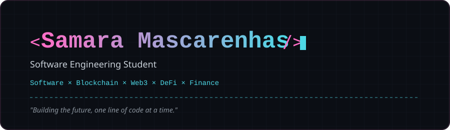

  

 

## 👩‍💻 Sobre mim

Estudante de Engenharia de Software, em formação como **Full Stack Developer**.

Hoje trabalho principalmente com **Python**, e uso **HTML**, **CSS** e **SQL** no dia a dia de estudo e projetos. Estou construindo minha base full stack — front, back e banco de dados passo a passo, com prática real.

🎯 **Objetivo de carreira:** migrar para o ecossistema **Web3** atuando com **Smart Contracts** e **DeFi**.

Esse perfil é o meu registro público de evolução, cada commit aqui é parte da jornada, não uma vitrine.

 

## 🛠️ Stack

### Atual

### Trilha de Aprendizado

 

## 🚀 Projetos

### 🔧 Laboratório de Aprendizagem
Repositório onde documento minha evolução prática em full stack estudos organizados por tecnologia (HTML/CSS, Python) e projetos aplicados.

---

### 🌐 Projeto Web 2026
Site em desenvolvimento dentro do learning-lab, com estrutura própria de front-end (HTML, CSS, assets, fontes). Em construção, integração com JavaScript.

 

## 📬 Contato

